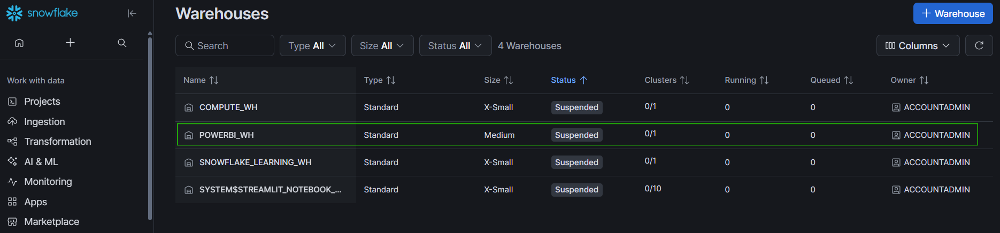
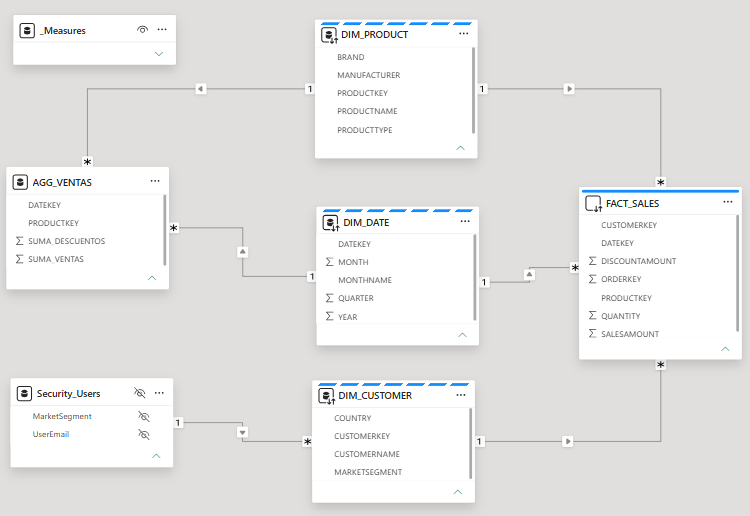
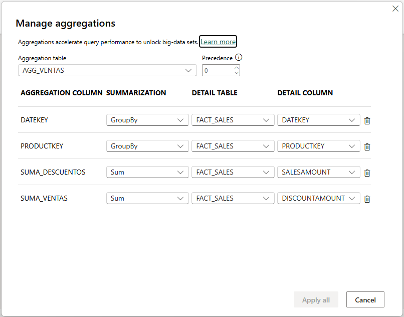
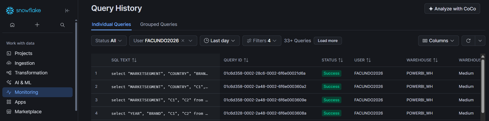
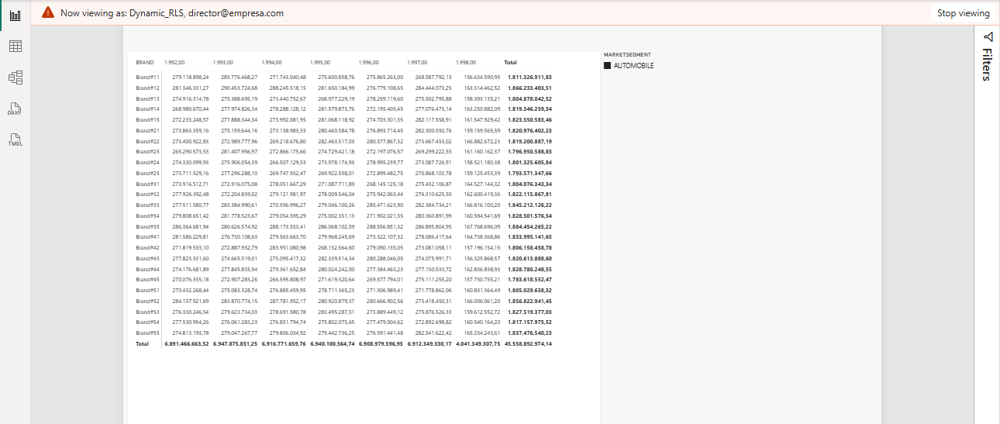
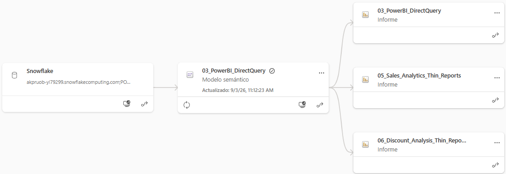

# Enterprise Analytics Architecture: Power BI & Snowflake Integration

## 📌 Project Overview & Objective
The objective of this repository is to demonstrate an enterprise-grade Analytics Data Architecture. **Please note: The Power BI dashboards included in this repository deliberately feature a basic UI/UX design.** The primary focus of this Proof of Concept (PoC) is the underlying engine: **data architecture, semantic layer development, gross-to-net business logic, performance optimization, and data security** required for large-scale enterprise environments (such as CPG or Retail).

This project integrates Snowflake as a Cloud Data Warehouse with Power BI, adhering to industry best practices for data modeling, ETL pushdown, and resource management.

---

## 🗄️ Repository Structure & Project Files

This repository separates data engineering scripts, core semantic models, and presentation layers. Scripts are numbered in execution order.

* 📁 **`sql_scripts`** (Data Engineering & ETL)
  * [📄 `01_snowflake_data_modeling.sql`](sql_scripts/01_snowflake_data_modeling.sql) — Warehouse configuration, DDL for the Star Schema, and gross-to-net derivation on the fact table.
  * [📄 `01b_snowflake_dim_date.sql`](sql_scripts/01b_snowflake_dim_date.sql) — Contiguous date dimension with a fiscal calendar, generated from the fact table's own date bounds.
  * [📄 `02_snowflake_view_agg_ventas.sql`](sql_scripts/02_snowflake_view_agg_ventas.sql) — SQL view for server-side aggregation.
  * [📄 `03_powerbi_query_folding_proof.sql`](sql_scripts/03_powerbi_query_folding_proof.sql) — SQL captured from Snowflake's query history, proving query folding from Power BI.

* 📁 **`powerbi_semantic_layer`** (Core Data Models — *exported as `.pbit` templates to keep full metadata without repository bloat*)
  * [📄 `04_PowerBI_Import_Mode.pbit`](powerbi_semantic_layer/04_PowerBI_Import_Mode.pbit) — Initial baseline test using 100% in-memory storage. **Deliberately frozen at its original state** as the record of the experiment that motivated the composite design.
  * [📄 `05_PowerBI_DirectQuery.pbit`](powerbi_semantic_layer/05_PowerBI_DirectQuery.pbit) — **The final core semantic layer**: composite model, gross-to-net measure cascade, time intelligence, and dynamic RLS.

* 📁 **`powerbi_thin_reports`** (Presentation Layer)
  * [📄 `06_Sales_Analytics_Thin_Reports.pbix`](powerbi_thin_reports/06_Sales_Analytics_Thin_Reports.pbix) — Live-connected report featuring decomposition trees.
  * [📄 `07_Discount_Analysis_Thin_Reports.pbix`](powerbi_thin_reports/07_Discount_Analysis_Thin_Reports.pbix) — Live-connected report featuring gross-to-net waterfall analysis.

* 📁 **`images`** — Architectural and configuration documentation.

---

## 🏗️ Architecture Breakdown & Strategic Decisions

### 1. Snowflake Integration & Compute Management
**Decision:** Push ETL transformations down to the Snowflake compute layer rather than relying on Power Query.

**Why:** Power Query relies on the local machine's or the Power BI Service's RAM. Executing transformations in Snowflake leverages its massively parallel processing architecture, which scales to billions of rows.

* Designed and deployed a Star Schema in Snowflake using the native `TPCH_SF1` sample dataset, simulating a CPG environment with a `FACT_SALES` table of over **6 million rows**.
* **Cost optimization:** configured a dedicated virtual warehouse (`POWERBI_WH`) with `AUTO_SUSPEND = 60`. If the dashboard is idle for one minute the compute cluster suspends itself, so idle dashboards do not bill.


*Figure 1: Snowflake virtual warehouse configured for Power BI querying.*

---

### 2. Gross-to-Net: Modeling the Business Logic Correctly
**Decision:** Convert the discount rate into a monetary amount at load time, keep amounts at full precision in storage, and express net revenue as a measure cascade rather than a materialized column.

**Why:** This is the single most consequential modeling decision in a sales model, and the easiest one to get silently wrong.

In the TPCH source, `L_DISCOUNT` is a **rate** — a decimal between 0 and 0.10 — not an amount. Loading it directly as a monetary column makes every downstream aggregation meaningless: summing rates does not produce money. The fact table therefore derives:

```
Gross Sales    = l_extendedprice
Discount Amt   = l_extendedprice * l_discount
Net Sales      = l_extendedprice * (1 - l_discount)
```

**Precision:** these amounts are stored **unrounded**. Rounding each derived amount independently at load time breaks the additive identity `Gross = Discount + Net` on ties, because half-up rounding pushes both sides in the same direction. Rounding belongs in the presentation layer.

**Weighted rates:** the discount percentage is derived in the semantic layer as `Discounts / Gross Sales`, never as an average of the rate column. An unweighted average of rates gives a $10 line the same weight as a $100,000 line — a distortion that would invalidate any trade promotion analysis.

**Reconciliation control:** a hidden `Net Sales Reconciliation` measure compares the semantic layer's cascade against an independently materialized net amount. It must return exactly zero. This control caught a rounding defect of nine parts per billion during development — small enough that no user would ever have reported it, which is precisely why the control exists.

---

### 3. A Date Dimension That Actually Supports Time Intelligence
**Decision:** Generate a contiguous calendar across the full fact range, including a fiscal calendar, and mark it as the model's date table.

**Why:** The initial date dimension was built with `SELECT DISTINCT` over order dates, which yields **only the days on which orders occurred**. A date dimension with gaps breaks DAX time intelligence in the most dangerous way possible: it raises no error and silently compares non-equivalent periods.

* The calendar is generated with `GENERATOR`, bounded by the fact table's own minimum and maximum dates, expanded to complete years.
* Validated for contiguity (day count equals the date span) and for referential integrity (zero fact rows without a matching calendar date).
* **Fiscal calendar included.** CPG companies rarely report on the calendar year, so `FiscalYear`, `FiscalQuarter` and `FiscalMonthNumber` are derived alongside the calendar equivalents, and a fiscal year-to-date measure is exposed in the semantic layer.
* Numeric label columns (`Year`, `Quarter`, `MonthNumber`) are set to *Don't summarize* **and** formatted as whole numbers without a thousands separator. These are two independent properties, and fixing only one leaves the model half-corrected.
* `MonthName` and `DayName` are sorted by their numeric counterparts so they order chronologically rather than alphabetically.

---

### 4. Semantic Layer & Robust Data Modeling
**Decision:** Build a centralized semantic layer instead of embedding data models inside individual reports.

**Why:** A single source of truth. When a business rule changes, it is updated in one place and every downstream report inherits it — no reprocessing of 6 million rows required.

* Best-practice **Star Schema** with conformed dimensions and single-direction filters.
* Relationship ambiguity resolved through proper keys (`DATEKEY`, `PRODUCTKEY`, `CUSTOMERKEY`).
* Business logic centralized in a dedicated `_Measures` table, organized into display folders — **Gross to Net**, **Time Intelligence**, **Volume**, **Data Quality**. A semantic layer consumed by multiple teams has to be navigable; a flat alphabetical list of measures is not a deliverable.
* Time intelligence covering year-over-year (absolute and percentage), calendar YTD, fiscal YTD, and rolling 12-month.
* Year-over-year measures explicitly return blank when no prior period exists, rather than reporting the first year's entire revenue as growth.
* Technical columns — the raw discount rate, the materialized net amount, the reconciliation measure, sort-order columns — are hidden from report view. A well-governed model is one where the user cannot pick the wrong field.


*Figure 2: The core Star Schema in Power BI, including the hidden aggregation and security tables.*

---

### 5. Performance Optimization: Composite Models & Aggregations
**Decision:** Move from the initial Import Mode baseline to a hybrid composite model.

**Why:** Holding 6 million rows in RAM is inefficient and hits dataset size limits; querying Snowflake on every click adds latency and compute cost. The composite model resolves both.

* **Import (aggregations):** high-level queries resolve against `AGG_VENTAS`, pre-aggregated at `(DateKey, ProductKey)` and held in memory.
* **DirectQuery (detail):** drill-downs route to the 6M-row `FACT_SALES` table in Snowflake.
* **Dual-mode dimensions:** `DIM_PRODUCT`, `DIM_DATE` and `DIM_CUSTOMER` are set to Dual storage. This lets them behave as in-memory tables when filtering the aggregation and as DirectQuery tables when filtering the fact — without it, the model raises relationship errors.
* **Note on the aggregation view:** the discount *rate* is deliberately excluded from the aggregation. Rates are not additive and cannot be pre-aggregated; the weighted percentage is derived at query time from two additive columns.

**Verification.** Aggregation routing was tested empirically rather than assumed:

| Query | Expected path | Snowflake query history |
|---|---|---|
| `Net Sales` by `Year` | Aggregation (in-memory) | No query generated |
| `Net Sales` by `Year` and `Country` | DirectQuery to fact | SQL against `FACT_SALES` |

Same measure, two behaviours, determined by whether the requested dimension exists in the aggregation. This is the proof that aggregation mapping is configured correctly.


*Figure 3: Aggregation configuration routing queries between RAM and Snowflake.*

---

### 6. Query Folding Proof
**Decision:** Audit the SQL generated by Power BI rather than trusting that optimization is working.

**Why:** Query folding is either happening or it isn't, and the only way to know is to read what the engine actually sent.

* Dashboard interactions translate into optimized SQL — `LEFT OUTER JOIN` and `GROUP BY` — pushed to the Snowflake engine.
* See [`03_powerbi_query_folding_proof.sql`](sql_scripts/03_powerbi_query_folding_proof.sql) for SQL captured verbatim during a DirectQuery drill-down.


*Figure 4: Snowflake query history showing folded SQL generated by Power BI.*

---

### 7. Data Security: Dynamic Row-Level Security
**Decision:** Implement dynamic RLS driven by an authorization table rather than static roles.

**Why:** Static roles require a model edit and a republish for every personnel change. Dynamic RLS turns an access change into a data change.

* A hidden `Security_Users` table maps user identities to the `MARKETSEGMENT` they are authorized to see, and is mapped to `DIM_CUSTOMER`.
* `USERPRINCIPALNAME()` reads the viewer's active session identity and filters accordingly.
* The relationship is configured to **apply the security filter in both directions**, so authorization propagates across the Star Schema to the fact table.

**Verification against the aggregation table.** The security path runs `Security_Users → DIM_CUSTOMER → FACT_SALES`, while `AGG_VENTAS` is related only to `DIM_DATE` and `DIM_PRODUCT`. This raises a legitimate question: when a query resolves against the aggregation instead of the fact, does the security filter still apply, or does the aggregation return unfiltered totals?

This was tested rather than assumed. Under `View as`, both the aggregation-served query and the fact-served query returned identical, correctly filtered results — `$43.28B` for a single-segment user against `$218.10B` unfiltered — with no Snowflake query generated for the aggregation path. The security filter is resolved before aggregation redirection, so the aggregation remains both secure and in play.

**The design principle worth stating:** if an aggregation table ever did need to be filtered by a security dimension it does not contain, the correct fix is to aggregate at the level of the *security dimension* (`MARKETSEGMENT`, five values) rather than the *entity key* (`CUSTOMERKEY`, 150,000 values). The first preserves the aggregation's usefulness; the second destroys it.


*Figure 5: Testing dynamic RLS to verify data masking based on the active session.*

---

### 8. Hub-and-Spoke Deployment (Thin Reports)
**Decision:** Deploy visualization layers as independent thin reports against a shared dataset.

**Why:** Decoupling the frontend from the backend lets multiple analysts build dashboards simultaneously without duplicating datasets or overwriting each other's modeling work.

* **Promoted shared dataset:** the semantic layer is published to the Power BI Service and marked as Promoted, establishing governance and data trust.
* **Thin reports** contain zero data. They connect live to the cloud dataset, keeping file sizes under 20 KB and guaranteeing single-source alignment.
* **The governance implication:** once other teams build on a shared model, a measure cannot be renamed or redefined without breaking their reports. That requires versioning discipline, lineage awareness, deployment pipelines, and a deprecation path for destructive changes. Additive changes ship freely; destructive ones need a communicated window. The failure mode to guard against is the silent semantic change — a measure that keeps its name but changes meaning, so nothing breaks and every downstream number is quietly wrong.


*Figure 6: Power BI Service lineage view showing the hub-and-spoke architecture.*

---

## 🔁 Execution Order

```
01_snowflake_data_modeling.sql     →  warehouse, dimensions, fact table
01b_snowflake_dim_date.sql         →  date dimension (requires Fact_Sales)
02_snowflake_view_agg_ventas.sql   →  aggregation view (requires Fact_Sales)
05_PowerBI_DirectQuery.pbit        →  semantic layer, published to the Service
06 / 07 thin reports               →  live connection to the published dataset
```

Each SQL script ends with validation queries. All must return zero before proceeding: the gross-to-net reconciliation delta, the calendar gap check, and the orphan fact date check.

---

Built by Facundo Arnaudo — [[LinkedIn]](https://www.linkedin.com/in/facundo-arnaudo-19b1a0106) · [[Portfolio]](https://github.com/facundoarnaudo)
